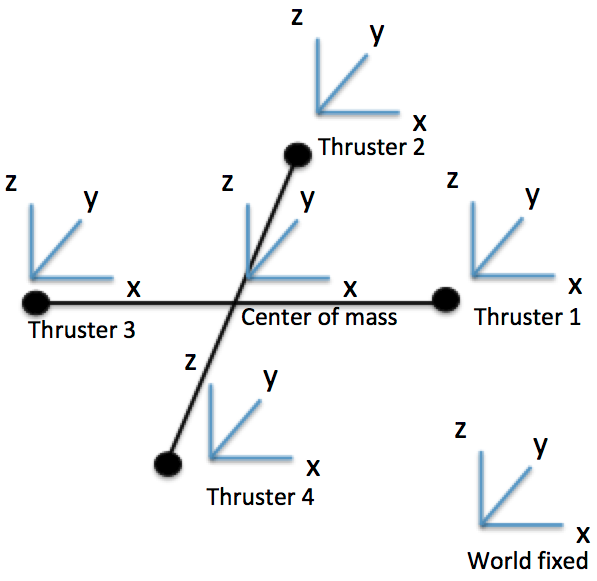
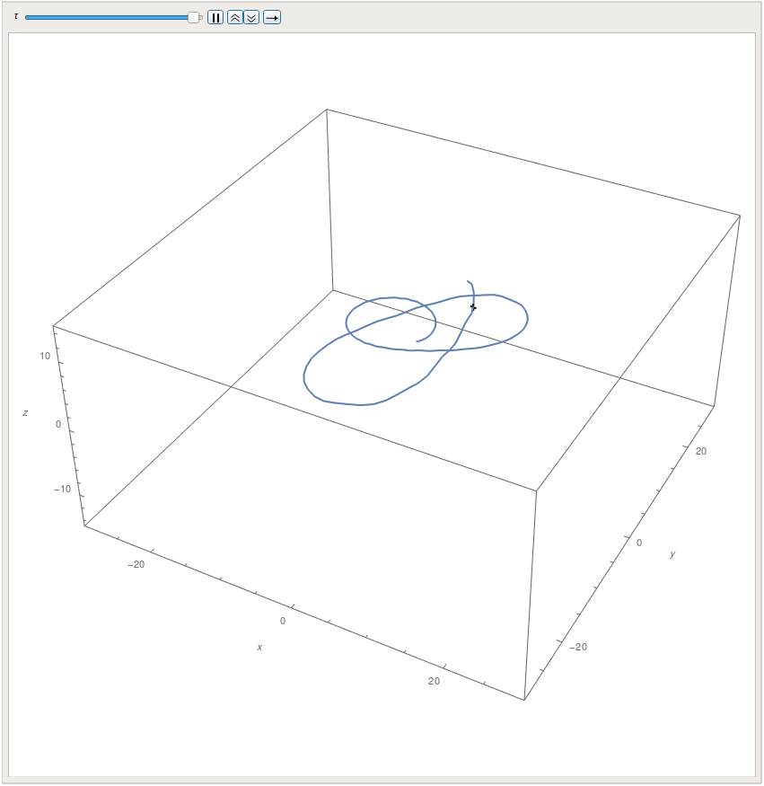
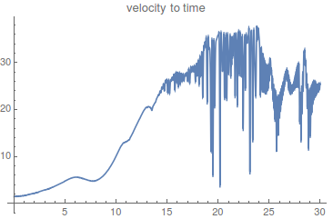
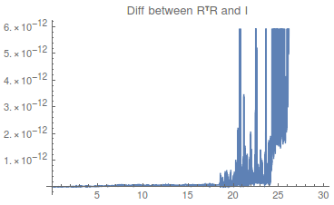
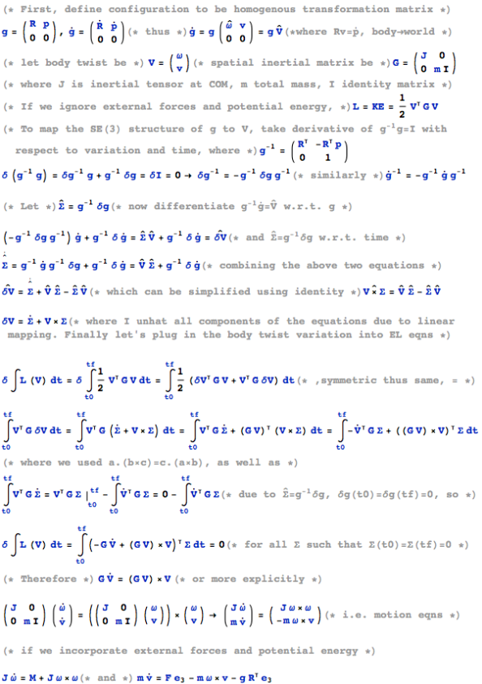

# Quadrotor Dynamics Evolving on SE(3)

In this project, I proposed using homogenous transformation matrix of group SE(3) as coordinates to set up Euler-Lagrange equations for the motion equations of a quadrotor in order to avoid considering any singularities. I implemented proportional control for the quadrotor to follow a circular trajectory. For the derivation of E-L equations, I scaled back from considering external forces and potential energy and only derived the case for kinetic energy.

### Model and Control Specification

In the illustration above, all frames except the world fixed frame are body frames. The homogeneous transformation matrix specifies the orientation and position of center of mass frame in the world frame. This setup gives us significant convenience to express thrust in body frames and via rigid body transformation to relate the first derivative of state configurations to the body twist.

In my simulation, the control inputs u1, u2, u3, and u4 represent the thrusts in body frames, which are determined by the proportional controller. As the desired trajectory is a circle at the same height, the proportional controller will adjust the thrust so that the quadrotor is tilted in the direction orthogonal to its velocity at an angle that balances gravity and centripetal force.

### Simulation Results

First, the dynamics looks good for the beginning as the quadrotor almost traces out a full circle, but then it starts doing ellipse. This is due to the fact that with only proportional control, the velocity is increased a little bit each time during overshoot. If I plot the velocity, it increases with time and thus the control inputs cannot maintain a fixed trajectory well.

Second, since I plug the motion equations in SE(3) directly into the default NDSolve integrator, the numerical simulation will drift for integration of SE(3) group. However the default integrator over a short period of time still gives credible results as you can see in the above plot. Within 20 seconds, RR ! − I is kept around 10e-14.

In the future, I will upgrade the controller to maintain a constant orbiting velocity, which should give me better circular traces.

### Motion Equations Derivation
if you care ...

### Code

This work is done in Mathematica, and code can be found [here](quadrotor_SE3.nb)

For more information, you can find me at my [portfolio page](https://yanweiw.github.io/).
